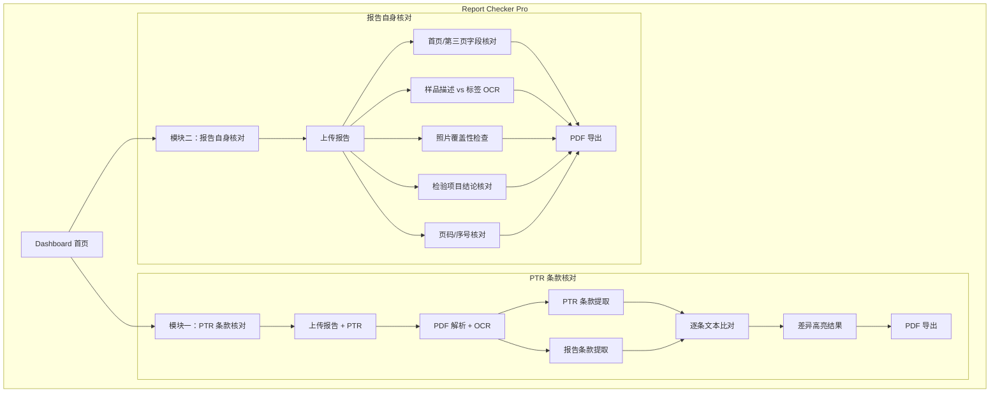

# Report Checker Pro — 产品需求文档 (PRD)

> **版本**: 1.0
> **日期**: 2026年3月2日
> **状态**: 初始版

---

## 1. 产品定位

### 1.1 问题陈述

医疗器械检验机构在检验报告的出具过程中，面临两类核对需求：

1. **报告与 PTR 的一致性**：撰写报告时依据的 PTR 可能不是最终盖章版本，条款文本必须与最终 PTR 逐字一致
2. **报告自身的一致性**：报告内部各字段（首页/第三页/标签/照片/检验项目）之间必须保持一致

目前靠人工逐项核对，工作量大、容易遗漏。

### 1.2 解决方案

一个 Web 应用，通过 Dashboard 提供两大功能模块入口：

- **PTR 条款核对**：上传报告 + PTR，自动逐条比对条款文本，高亮差异
- **报告自身核对**：上传报告，自动检查字段一致性、照片覆盖、检验项目结论等

### 1.3 目标用户

检验报告撰写人员、审核人员。

### 1.4 部署形态

纯 Web 应用，浏览器访问，不依赖 Electron。

---

## 2. 功能模块总览



---

## 3. Dashboard 首页

### 3.1 功能描述

应用启动后首先展示 Dashboard 页面，提供两个功能模块的入口。

### 3.2 页面元素

- **应用标题**：`Report Checker Pro`，居中显示
- **应用副标题**：`检验报告综合核对工具`
- **功能入口卡片**（2个，横向排列）：

| 卡片 | 图标 | 标题 | 描述 | 上传要求 |
|-----|------|------|------|---------|
| PTR 条款核对 | 📄↔📄 | PTR 条款核对 | 核对检验报告与产品技术要求的条款文本一致性 | 上传 2 个 PDF |
| 报告自身核对 | 📋✓ | 报告自身核对 | 检查报告内部字段一致性、照片覆盖、检验项目结论 | 上传 1 个 PDF |

### 3.3 交互设计

- 卡片使用 `GlassCard` 容器，悬停时有微弹效果
- 点击卡片进入对应功能页面
- 每个功能页面左上角有返回 Dashboard 的按钮

---

## 4. 模块一：PTR 条款核对

### 4.1 业务背景

检验报告中"标准要求"列的文本，必须和 PTR 第2章中的条款原文**逐字一致**。因为报告撰写人可能参照的是 PTR 草稿版，而非最终盖章版，所以需要逐条核对。

核对的本质是：**将 PTR 第2章的条款文本，与报告检验表格中"标准要求"列的文本进行逐条比对**。

### 4.2 报告 PDF 结构（详细说明）

> 🔗 本节定义报告结构，供 **§4.6 报告解析逻辑** 实现时参照。其中 §4.2.3 定义的标准内容判定规则，由 §4.6.1 在解析时具体执行。

#### 4.2.1 总体结构

报告是电子版 PDF（非扫描件），页面结构固定：

```
┌─────────────────────────────────────┐
│ PDF 第1页：封面                      │ ← 包含报告编号、样品名称等
├─────────────────────────────────────┤
│ PDF 第2页：注意事项                  │ ← 固定模板，不参与核对
├─────────────────────────────────────┤
│ PDF 第3页：报告首页                  │ ← ⭐ 包含"检验项目"字段
│   - 页眉含"检验报告首页"             │
│   - 字段：委托方、样品名称、型号规格  │
│   - 字段：检验项目（标明PTR条款范围） │
├─────────────────────────────────────┤
│ PDF 第4页：报告第2页                 │ ← 可能标注标准序号范围
│   - "型号规格或其他说明"区域          │
│   - 可能注明"序号1~N为GB XXXX"       │
├─────────────────────────────────────┤
│ PDF 第5页起：检验结果表格            │ ← ⭐ 核对的主要数据来源
│   - 7列表格，逐条记录检验项目         │
│   - 可能跨多页                      │
└─────────────────────────────────────┘
```

#### 4.2.2 检验结果表格结构

从 PDF 第5页开始（有些报告可能从第4页开始），是一个7列表格：

| 序号 | 检验项目 | 标准条款 | 标准要求 | 检验结果 | 单项结论 | 备注 |
|-----|---------|---------|---------|---------|---------|-----|
| 1 | 外观检查 | 6.1 | 无锋利边缘... | 符合要求 | 符合 | |
| 2 | 外壳材料 | 6.2 | 外壳应采用... | 符合要求 | 符合 | |
| ... | ... | ... | ... | ... | ... | ... |
| 119 | 工作频率 | 2.1 | 工作频率为13.56MHz±7kHz | 13.56MHz | 符合 | |
| 120 | 输出功率 | 2.2 | 输出功率应≤200W | 180W | 符合 | |
| ... | ... | ... | ... | ... | ... | ... |

**各列含义**：

- **序号**：从1开始递增。跨页续行时标记"续X"（如"续3"）
- **检验项目**：检验内容的名称（如"工作频率""输出功率"）
- **标准条款**：只包含条款号（如 `6.1`、`2.1`），**不包含标准编号（如 GB 9706.1）和"​PTR"​字样**
- **标准要求**：⭐ **核对目标** — 这一列的文本应与 PTR 原文一致
- **检验结果**：实验室实际测量值或"符合要求"/"不符合要求"
- **单项结论**：符合 / 不符合 / /
- **备注**：补充说明

#### 4.2.3 标准内容判定与核对范围确定

报告中可能有一部分序号引用的是国标/行标（如 GB、GB/T、YY、YY/T 等）而非 PTR，这些不属于核对范围。

**判定方法**：

1. 在 PDF 第4页"型号规格或其他说明"区域中，搜索是否包含**"标准的内容"字样**
2. 如果存在 → 本报告含标准内容，解析该段文字中的序号范围
3. 如果不存在 → 本报告不含标准内容，序号1即为 PTR 第一个条款

**实际示例**：

第4页"型号规格或其他说明"中可能出现如下文字：

> 本次检验，序号 1～序号 118 为 GB 9706.1-2020 **标准的内容**，序号 119～序号 156 为 GB 9706.202-2021 **标准的内容**，序号 157、序号 158 为 YY/T 1057-2016 **标准的内容**。

解析结果：
- 序号 1~158：全部为标准内容 → **不核对**
- 序号 159 起：PTR 条款 → **核对范围**

**解析规则**：
- 匹配“序号 X～序号 Y”或“序号 X、序号 Y”格式的序号范围
- 可能包含多个标准（GB、GB/T、YY、YY/T 等），所有标准内容的序号求并集
- 最大标准序号之后的序号即为 PTR 核对起始点

### 4.3 PTR PDF 结构（详细说明）

> 🔗 本节定义 PTR 结构，供 **§4.5 PTR 解析逻辑** 实现时参照。其中 §4.3.3 的"见表X"引用规则，由 §4.5.4 具体解析。

#### 4.3.1 总体结构

PTR 可能是电子版或扫描件，结构如下：

```
┌─────────────────────────────────────┐
│ 第1章：产品型号/规格说明             │
│   - 产品基本信息                     │
│   - 参数表格（型号、尺寸、重量等）    │
│   - 可能包含被引用表格（表1、表2...） │
├─────────────────────────────────────┤
│ 第2章：（章节名不固定）              │ ← ⭐ 核对目标
│   - 可能叫"性能指标""性能要求"等      │
│   - 按编号 2.1、2.2... 列出各条款    │
│   - 每个条款包含具体的技术要求文本    │
├─────────────────────────────────────┤
│ 第3章：检验方法                      │ ← 不参与核对
├─────────────────────────────────────┤
│ 附录（可选）                         │ ← 可能包含被引用的表格
└─────────────────────────────────────┘
```

#### 4.3.2 第2章条款结构示例

```
2 性能指标

2.1 工作频率
    工作频率为13.56MHz±7kHz。

2.2 输出功率
    最大输出功率应不超过200W。

2.3 电气安全
    2.3.1 漏电流
        工作温度范围内，漏电流应≤100μA。
    2.3.2 绝缘电阻
        a) 对地绝缘电阻应≥2MΩ；
        b) 对患者回路绝缘电阻应≥5MΩ。

2.4 尺寸
    产品外形尺寸见表1。
```

**关键特征**：

- **条款层级**：2 → 2.1 → 2.1.1 → 2.1.1.1，通常 2~3 级，最多 5~6 级
- **子项列举**：a) b) c) 形式、a、b、c 形式、——/— 连接形式
- **表格引用**：条款文本可能写"见表1""见表2"，引用第1章或附录中的表格

#### 4.3.3 "见表X"引用示例

当条款写"产品外形尺寸见表1"时，需要：
1. 在 PTR 中找到"表1"的实际位置（可能在第1章、附录等）
2. 提取表格内容（参数名称 + 参数值）
3. 将表格内容与报告中对应条款展开的内容进行比对

### 4.4 PDF 解析引擎

> 🔗 本节是底层共享能力，同时供 **§4.5 PTR 解析** 和 **§4.6 报告解析** 调用，也供模块二（§5 报告自身核对）中的 PDF 解析和 OCR 服务共用。

#### 4.4.1 电子版解析

- 使用 PyMuPDF (fitz) 提取文字和表格
- 保留行列关系和合并单元格
- 提取每页的文字块及其坐标位置

#### 4.4.2 扫描版 OCR

PTR 可能是扫描件，需要 OCR：

- 使用 PaddleOCR 进行中文识别
- 保留文字块的位置坐标，用于重建表格结构和段落关系
- **特殊符号后处理**：PTR 中常出现工程符号，PaddleOCR 可能误识别，可进行后处理修正，但修正后必须输出 **WARNING** 提示用户人工确认：

| 正确符号 | 常见 OCR 误识别 | 后处理策略 |
|---------|---------------|-----------|
| `Ω`（欧姆） | `Q`、`O`、乱码 | 在电阻相关上下文中，`Q`/`O` 修正为 `Ω` |
| `±`（正负） | `+`、`土`、`±` 乱码 | 数值前的 `土` 修正为 `±` |
| `℃`（摄氏度） | `°C`（两个字符）、`C` | 统一为 `℃` |
| `²` `³`（上标） | 普通数字 `2` `3` | 在单位上下文中（如 `mm2`）修正为上标 |
| `μ`（微） | `u`、`μ` 乱码 | 在单位上下文中修正为 `μ` |
| `≤` `≥` | `<`、`>`、`三`、乱码 | 上下文修正 |

> ❗ 每次特殊符号后处理修正后，结果中必须输出 WARNING 信息，标注修正前后的值和位置，供用户人工确认。

#### 4.4.3 智能切换

- 每页优先尝试电子版提取
- 若提取文字 < 50 字符/页，判定为扫描件，自动切换 OCR
- 同一 PDF 内可能混合（部分页电子版、部分页扫描件）

### 4.5 PTR 解析逻辑

> 🔗 依赖 **§4.4 PDF 解析引擎** 的输出（文字/表格数据），按 **§4.3 PTR 结构** 定义的规则解析。输出的条款列表供 **§4.7 文本比对算法** 使用。

**目标**：从 PTR PDF 中提取第2章的所有条款，输出结构化列表。

#### 4.5.1 定位第2章

- 在全文中搜索以 `2` 或 `2.` 开头、且为章节标题格式的文本
- 第2章结束位置：遇到以 `3` 或 `3.` 开头的章节标题
- 不依赖章节名称（可能叫"性能指标""性能要求"等）

#### 4.5.2 条款编号解析

识别编号格式：`2.1`、`2.1.1`、`2.1.1.1` 等。

```
输入文本:
  "2.3 电气安全"
  "  2.3.1 漏电流"
  "  工作温度范围内，漏电流应≤100μA。"

输出结构:
  {
    clause_id: "2.3.1",
    title: "漏电流",
    parent_id: "2.3",
    text: "工作温度范围内，漏电流应≤100μA。"
  }
```

#### 4.5.3 子项识别

条款内部可能有以下形式的子项列举：

- `a) b) c)` 形式
- `a、b、c` 形式
- `——` 或 `—` 连接形式

```
示例: "a) 对地绝缘电阻应≥2MΩ；\nb) 对患者回路绝缘电阻应≥5MΩ。"
处理: 作为条款文本的一部分保留，不拆分为独立条款
```

#### 4.5.4 表格引用解析

检测条款中的"见表X"关键词：

```
输入: "产品外形尺寸见表1。"
处理:
  1. 在 PTR 全文中搜索"表1"的位置
  2. 提取该表格内容（参数名 + 参数值）
  3. 将表格数据关联到当前条款
```

### 4.6 报告解析逻辑

> 🔗 依赖 **§4.4 PDF 解析引擎** 的输出，按 **§4.2 报告结构** 定义的规则解析。其中 §4.6.1 核对范围确定逻辑来自 **§4.2.3 标准内容判定**。输出的报告条目列表供 **§4.7 文本比对算法** 使用。**§4.6.2 表格解析** 是两模块共享能力，模块二的 C07-C10（§5.3）复用同一解析结果。

**目标**：从报告 PDF 中提取检验结果表格，输出结构化列表。

#### 4.6.1 确定核对范围

1. 从 PDF 第3页的"检验项目"字段，获取 PTR 条款范围
2. 从 PDF 第4页"型号规格或其他说明"中搜索"标准的内容"字样，解析标准序号范围
3. 据此确定：标准序号范围内的序号跳过，其余序号为 PTR 核对范围

#### 4.6.2 表格解析

解析7列检验结果表格，需处理以下复杂情况：

**合并单元格**：一个序号可能对应多行（多个标准要求拆分在多行中）

```
| 序号 | 检验项目     | 标准条款 | 标准要求（行1）       | 检验结果 | 单项结论 | 备注 |
|  3   | 电气安全     | 2.3      | a) 漏电流应≤100μA    | 80μA    |  符合   |     |
|      |              |          | b) 绝缘电阻应≥2MΩ   | 5MΩ     |         |     |
```

→ 需要识别出序号3有两行标准要求，合并后比对。

**跨页续行**：表格跨页时，新页第一行序号前加"续"字

```
第X页末尾:  | 5 | 输出功率 | PTR 2.5 | 最大输出功率应不超过... |
第X+1页开头: | 续5 |         |         | ...200W               |
```

→ 需要识别"续5"并与上页的序号5合并。

#### 4.6.3 输出结构

```
{
  seq: 3,
  inspection_item: "电气安全",
  standard_clause: "PTR 2.3",
  standard_requirement: "a) 漏电流应≤100μA b) 绝缘电阻应≥2MΩ",  ← 多行合并
  inspection_result: "80μA / 5MΩ",
  conclusion: "符合",
  remarks: ""
}
```

### 4.7 文本比对算法

> 🔗 输入来自 **§4.5 PTR 解析** 的条款列表 + **§4.6 报告解析** 的报告条目列表。输出的比对结果供 **§4.8 结果展示** 和 **§4.9 PDF 导出** 使用。

#### 4.7.1 文本标准化（比对前预处理）

| 标准化项 | 说明 | 示例 |
|---------|------|------|
| 全角/半角统一 | 全角字符转半角 | `（` → `(`，`１` → `1` |
| 多余空格去除 | 连续空格合并为单个 | `漏电流  应` → `漏电流 应` |
| 自然换行合并 | 因列宽导致的换行合并为连续文本 | `最大输出功率\n应不超过200W` → `最大输出功率应不超过200W` |
| 格式性标注去除 | 去除报告中添加的格式标注 | `最大输出功率应不超过200W（单位：W）` → `最大输出功率应不超过200W` |

#### 4.7.2 条款正文比对规则

**核心规则：严格匹配**

报告"标准要求"列的文本，必须与 PTR 条款原文**严格一致**，任何不匹配均判定为不一致。

```
PTR 原文:    "工作频率为13.56MHz±7kHz"
报告文本:    "工作频率为13.56MHz±7kHz"
判定:        ✅ 一致
```

```
PTR 原文:    "工作频率为13.56MHz±7kHz"
报告文本:    "工作频率为13.56MHz±7kHz（用频谱仪测量）"
判定:        ❌ 不一致（报告文本在原文后追加了内容）
```

```
PTR 原文:    "最大输出功率应不超过200W"
报告文本:    "最大输出功率应不超过100W"
判定:        ❌ 不一致（"200W"被改为"100W"）
```

**规则总结**：
- ✅ 报告文本与 PTR 原文完全一致
- ❌ 任何字符差异均判定为不一致
- 使用 diff 算法定位具体差异位置

#### 4.7.3 "见表X"展开内容比对

当 PTR 条款含"见表X"时，报告中该条款通常会展开写出表格内容。需核对：

1. **参数名称**：报告列出的参数名与 PTR 源表一致
2. **参数值**：报告列出的参数值与 PTR 源表一致

### 4.8 结果展示

> 🔗 展示 **§4.7 文本比对算法** 的输出结果。可触发 **§4.9 PDF 导出**。

#### 4.8.1 总览

- 条款总数、一致/不一致数量（AnimatedCounter）
- 一致率百分比
- 语义色标识：灰绿=一致，灰红=不一致

#### 4.8.2 逐条详情

- 条款编号 + 标题 + 状态标签
- 列表项错位入场动画
- 点击展开查看详情

#### 4.8.3 差异高亮

- PTR 原文和报告文本并排对比
- 差异字符高亮（灰红=缺失，灰绿=多出，灰金=修改）

### 4.9 PDF 导出

> 🔗 导出 **§4.8 结果展示** 的数据。导出服务与模块二（§5.6）共用同一导出引擎。

- 导出 PTR 核对结果为 PDF 报告
- 包含：核对总览统计 + 每条条款比对结果 + 差异标注

---

## 5. 模块二：报告自身核对

> 🔗 本模块与模块一共享 **§4.4 PDF 解析引擎**。OCR 服务见 **§5.4**，结果展示见 **§5.5**，PDF 导出见 **§5.6**（与§4.9 共用导出引擎）。

### 5.1 输入

- 1 个 PDF 格式检验报告
- 文件大小限制：50MB

### 5.2 核对项清单

| 编号 | 核对类别 | 核对对象 | 错误级别 |
|-----|---------|---------|---------:|
| C01 | 首页与第三页一致性 | 委托方、样品名称、型号规格 | ERROR |
| C02 | 第三页扩展字段 | 型号规格、生产日期、产品编号/批号 | ERROR |
| C03 | 生产日期格式 | 表格与标签格式一致性 | ERROR |
| C04 | 样品描述表格 | 各部件字段与标签比对 | ERROR/WARN |
| C05 | 照片覆盖性 | 每个部件至少一张照片 | ERROR |
| C06 | 中文标签覆盖 | 单一部件至少一张中文标签 | ERROR |
| C07 | 检验项目-单项结论 | 结论与检验结果逻辑一致性 | ERROR |
| C08 | 检验项目-非空字段 | 检验结果/单项结论/备注非空 | ERROR |
| C09 | 检验项目-序号连续性 | 序号连续无跳号 | ERROR |
| C10 | 检验项目-续表标记 | 跨页续表正确标记 | ERROR |
| C11 | 页码连续性 | 页码 Y 连续递增，末页 Y=XXX | ERROR |

### 5.3 各核对项详细规则

> 🔗 C02/C03/C04/C06 的"来源 B"均依赖 **§5.4 OCR 服务** 提取中文标签值。C04 定义的"样品描述表格"位置规则，C05/C06 复用。C07-C10 均操作同一个"检验项目表格"（结构同§4.2.2）。5.3 的核对结果供 **§5.5 结果展示** 和 **§5.6 PDF 导出** 使用。

#### C01: 首页与第三页一致性核对

- **数据来源**：
  - 来源 A：报告**首页**（PDF 第1页）的字段
  - 来源 B：报告**第三页**（页眉包含"检验报告首页"的页面）的对应字段
- **核对对象**：`委 托 方`、`样品名称`、`型号规格` 三个字段
- **核对规则**：严格一致（字符级完全一致）
- **判定结果**：
  - ✅ 三个字段全部严格一致 → PASS
  - ❌ 任意字段不一致 → ERROR

---

#### C02: 第三页扩展字段核对

> 🔗 规则2的标签 OCR 依赖 **§5.4 OCR 服务**。C02 规则1 的判定结果会影响 **C03** 是否触发。

- **数据来源**：
  - 来源 A：报告**第三页**（页眉包含"检验报告首页"的页面）表格中的三个字段
  - 来源 B：**照片页**中 Caption 主体名与第三页"样品名称"一致的**中文标签**，OCR 提取的字段值
- **核对对象**：`型号规格`、`生产日期`、`产品编号/批号`、`委托方`、`委托方地址` 五个字段
- **核对规则**：分两步执行

**规则1："见样品描述栏"一致性校验**（仅针对`型号规格`、`生产日期`、`产品编号/批号`三个字段）
- 三个字段全部为"见'样品描述'栏" → ✅ PASS（这三个字段结束，`委托方`和`委托方地址`仍需规则2比对）
- 三个字段全部不是"见'样品描述'栏" → 进入规则2（五个字段均比对）
- 部分是"见'样品描述'栏" → ❌ ERROR（三个字段必须统一）

**规则2：标签字段比对**

从照片页中找到 Caption 主体名与第三页"样品名称"一致的中文标签，将第三页表格值与该标签 OCR 提取值进行比对：

| 第三页表格字段 | 标签字段映射（OCR 提取） |
|-------------|---------------------|
| `型号规格` | `型号` / `规格` / `规格型号` |
| `生产日期` | `MFG` / `MFD` / `生产日期` |
| `产品编号/批号` | `批号` / `LOT` / `序列号` / `SN` |
| `委托方` | `注册人` / `注册人名称` |
| `委托方地址` | `注册人住所` / `注册人地址` |

- **判定结果**：
  - ✅ 表格值与标签 OCR 值一致 → PASS
  - ❌ 表格值与标签 OCR 值不一致 → ERROR

---

#### C03: 生产日期格式与值一致性核对

> 🔗 触发条件依赖 **C02 规则1** 的判定结果。标签 OCR 依赖 **§5.4 OCR 服务**。

- **数据来源**：
  - 来源 A：报告**第三页**表格的 `生产日期` 字段值
  - 来源 B：**照片页**中 Caption 主体名与第三页"样品名称"一致的中文标签，OCR 提取的生产日期值
- **核对对象**：生产日期的**格式模式**和**日期值**
- **触发条件**：第三页 `生产日期` ≠ "见'样品描述'栏"（即 C02 规则1判定为"全部不是"时）
- **核对规则**：格式（如 `.` vs `/` vs `-`）和值都必须一致，以标签为基准
- **判定结果**：
  - ✅ 格式和值都一致 → PASS
  - ❌ 格式不一致 → ERROR
  - ❌ 值不一致 → ERROR
- **示例**：

| 第三页表格 | 中文标签 OCR | 判定 |
|-----------|------------|------|
| `2026.01.08` | `2026/01/08` | ❌ 格式不一致（`.` vs `/`） |
| `2026-01-08` | `2026-01-09` | ❌ 值不一致 |
| `2026-01-08` | `2026-01-08` | ✅ PASS |

---

#### C04: 样品描述表格核对

> 🔗 本节定义的"样品描述表格"位置规则，**C05** 和 **C06** 复用。标签 OCR 依趖 **§5.4 OCR 服务**。

- **数据来源**：
  - 来源 A：**样品描述表格**（从第四页起，页面文本包含"样品描述"的页面中的表格）
  - 来源 B：**照片页**中各部件对应的**中文标签**，OCR 提取的字段值
- **核对对象**：表格每行（每个部件）的字段值与该部件对应中文标签 OCR 值
- **核对规则**：严格一致，`/` 或空白视为无值，与标签无该字段等价
- **判定结果**：
  - ✅ 一致 → PASS
  - ❌ 不一致 → ERROR
- **忽略列**：`序号`、`备注`
- **同义词映射**：

| 标准列名 | 可识别的同义词 |
|---------|-------------|
| `部件名称` | 部件名称、产品名称、名称 |
| `规格型号` | 规格型号、型号规格、型号、规格 |
| `序列号批号` | 序列号批号、序列号/批号、批号、序列号、SN、LOT |
| `生产日期` | 生产日期、MFG、MFD |
| `失效日期` | 失效日期、有效期至、EXP |

---

#### C05: 照片覆盖性核对

> 🔗 来源 A 复用 **C04** 定义的样品描述表格。

- **数据来源**：
  - 来源 A：**样品描述表格**中的每个部件（`部件名称`列）
  - 来源 B：**照片页**中所有照片的 Caption 主体名
- **核对对象**：每个部件是否至少有一张照片覆盖
- **核对规则**：Caption 主体名与部件名称匹配（支持精确匹配 + 部分匹配）
- **判定结果**：
  - ✅ 部件有至少一张照片匹配 → PASS
  - ❌ 部件无任何照片匹配 → ERROR
- **忽略/特殊处理**：备注列包含"本次检测未使用"的部件，无照片不报错

---

#### C06: 中文标签覆盖核对

> 🔗 来源 A 复用 **C04** 定义的样品描述表格。标签 OCR 依赖 **§5.4 OCR 服务**。

- **数据来源**：
  - 来源 A：**样品描述表格**中的每个部件（`部件名称`列）
  - 来源 B：**照片页**中所有中文标签的 Caption 主体名（Caption 包含"中文标签"/"中文标签样张"/"标签样张"等关键词）
- **核对对象**：每个部件是否至少有一张中文标签覆盖
- **核对规则**：
  - 单一部件：至少有一张中文标签匹配
  - 同名多行部件：多张标签，按"非空字段联合键"分别匹配
- **判定结果**：
  - ✅ 部件有至少一张中文标签匹配 → PASS
  - ❌ 部件无任何中文标签匹配 → ERROR
- **忽略/特殊处理**：备注列包含"本次检测未使用"的部件，无标签不报错

---

#### C07: 检验项目-单项结论核对

> 🔗 本节与 C08/C09/C10 共同操作同一个"检验项目表格"，表格结构同 **§4.2.2**，解析逻辑复用 **§4.6.2 表格解析**（无需 §4.6.1 的标准内容过滤）。

- **数据来源**：
  - 来源：**检验项目表格**（表头包含：序号、检验项目、标准条款、标准要求、检验结果、单项结论、备注）
- **核对对象**：每个序号的`单项结论`是否与`检验结果`逻辑一致
- **核对规则**：按优先级判定期望结论，与实际结论比对

| 优先级 | 条件 | 期望结论 |
|-------|------|---------|
| 1 | 任意标准要求的检验结果 = "不符合要求" 或空白 | `不符合` |
| 2 | 所有标准要求的检验结果 = "——" 或 "/" | `/` |
| 3 | 任意标准要求的检验结果 = "符合要求" 或非空文本/数字 | `符合` |

- **判定结果**：
  - ✅ 实际单项结论 = 期望单项结论 → PASS
  - ❌ 实际单项结论 ≠ 期望单项结论 → ERROR

---

#### C08: 检验项目-非空字段核对

- **数据来源**：
  - 来源：**检验项目表格**
- **核对对象**：每行的 `检验结果`、`单项结论`、`备注` 三个字段
- **核对规则**：三个字段均不得为空
- **判定结果**：
  - ✅ 三字段均非空 → PASS
  - ❌ 任意字段为空 → ERROR
- **特殊处理**：合并单元格以合并区域首行值为准，首行为空则整个区域视为空

---

#### C09: 检验项目-序号连续性核对

- **数据来源**：
  - 来源：**检验项目表格**的`序号`列
- **核对对象**：序号的连续性和完整性
- **核对规则**：序号从1开始连续递增，无跳号、无重复、无空白
- **判定结果**：
  - ✅ 序号连续完整 → PASS
  - ❌ 序号跳号/重复/空白 → ERROR

---

#### C10: 检验项目-续表标记核对

- **数据来源**：
  - 来源：**检验项目表格**跨页时的序号列
- **核对对象**：跨页续行的"续"字标记
- **核对规则**：同一序号跨页时，新页第一行的序号前必须加"续"字；"续"字只能出现在本页第一行
- **判定结果**：
  - ✅ 续表标记正确 → PASS
  - ❌ 缺少续表标记 → ERROR
  - ❌ 续字位置错误 → ERROR

---

#### C11: 页码连续性核对

- **数据来源**：
  - 来源：从**第三页**开始，每页**右上角**的页码文字（格式：`共XXX页 第Y页`）
- **核对对象**：页码 Y 的连续性和 XXX 的一致性
- **核对规则**：
  - Y 从1开始连续递增，无跳号、无重复
  - 最后一页的 Y 值必须等于 XXX
  - 所有页的 XXX 值必须相同
- **判定结果**：
  - ✅ 全部满足 → PASS
  - ❌ Y 不连续 → ERROR
  - ❌ 末页 Y ≠ XXX → ERROR
  - ❌ XXX 不一致 → ERROR

### 5.4 OCR 与 VLM/LLM 增强

> 🔗 为 C02/C03/C04/C06 提供中文标签 OCR 提取能力。底层 OCR 引擎与 **§4.4 PDF 解析引擎** 共用。VLM 引擎为 OCR 失败时的增强手段。

- OCR 引擎：PaddleOCR
- VLM 增强：OCR 失败时可调用 GPT-4o / Gemini 视觉模型
- 三种模式：`enhance`/`fallback`/`disabled`
- 用户可在上传页面通过开关启用 LLM 增强

### 5.5 结果展示

> 🔗 展示 **§5.3 C01-C11** 的核对结果。可触发 **§5.6 PDF 导出**。

#### 5.5.1 总览

- 核对统计：总项目数、通过/失败/警告数
- 错误分级：ERROR（必须修复）、WARN（需人工复核）、INFO（参考）
- 错误色标：ERROR 灰红、WARN 灰金、PASS 灰绿

#### 5.5.2 分区展示 — 各核对项展示内容

按核对类别分区展示，每项显示比对双方的实际数据和判定结果。

**交互设计**：每个核对项区域默认**折叠**，仅显示核对项名称和整体判定状态（✅/❌）。用户点击可**展开**查看详细比对内容。有 ERROR 的核对项在标题行用灰红色标识，方便快速定位问题。

---

**C01: 首页与第三页一致性**

| 字段 | 首页值 | 第三页值 | 判定 |
|-----|-------|---------|------|
| 委 托 方 | `{首页提取值}` | `{第三页提取值}` | ✅/❌ |
| 样品名称 | `{首页提取值}` | `{第三页提取值}` | ✅/❌ |
| 型号规格 | `{首页提取值}` | `{第三页提取值}` | ✅/❌ |

---

**C02: 第三页扩展字段**

先展示规则1判定结果（是否为"见样品描述栏"），再展示规则2比对详情：

| 字段 | 第三页表格值 | 中文标签 OCR 值 | 判定 |
|-----|-----------|---------------|------|
| 型号规格 | `{表格值}` | `{OCR值}` | ✅/❌ |
| 生产日期 | `{表格值}` | `{OCR值}` | ✅/❌ |
| 产品编号/批号 | `{表格值}` | `{OCR值}` | ✅/❌ |
| 委托方 | `{表格值}` | `{OCR值: 注册人}` | ✅/❌ |
| 委托方地址 | `{表格值}` | `{OCR值: 注册人住所}` | ✅/❌ |

---

**C03: 生产日期格式与值**

| 项目 | 第三页表格 | 中文标签 OCR | 判定 |
|-----|-----------|------------|------|
| 日期值 | `{表格日期}` | `{OCR日期}` | ✅/❌ |
| 格式模式 | `{如 YYYY.MM.DD}` | `{如 YYYY/MM/DD}` | ✅/❌ |

---

**C04: 样品描述表格**

按部件逐行展示，每个部件展开显示各字段比对：

| 部件名称 | 字段 | 表格值 | 标签 OCR 值 | 判定 |
|---------|-----|-------|-----------|------|
| 主机 | 规格型号 | `{表格值}` | `{OCR值}` | ✅/❌ |
| 主机 | 序列号批号 | `{表格值}` | `{OCR值}` | ✅/❌ |
| 主机 | 生产日期 | `{表格值}` | `{OCR值}` | ✅/❌ |
| 主机 | 失效日期 | `{表格值}` | `{OCR值}` | ✅/❌ |
| 导管 | ... | ... | ... | ... |

---

**C05: 照片覆盖性**

| 部件名称 | 匹配到的照片 Caption | 判定 |
|---------|-------------------|------|
| 主机 | `№1 主机` | ✅ |
| 导管 | （无匹配） | ❌ |

---

**C06: 中文标签覆盖**

| 部件名称 | 匹配到的标签 Caption | 判定 |
|---------|-------------------|------|
| 主机 | `主机 中文标签` | ✅ |
| 导管 | （无匹配） | ❌ |

---

**C07: 检验项目-单项结论**

| 序号 | 检验项目 | 检验结果 | 期望结论 | 实际结论 | 判定 |
|-----|---------|---------|---------|---------|------|
| 1 | `{项目名}` | `{结果值}` | `符合` | `符合` | ✅ |
| 2 | `{项目名}` | `{结果值}` | `/` | `符合` | ❌ |

---

**C08: 检验项目-非空字段**

| 序号 | 检验项目 | 检验结果 | 单项结论 | 备注 | 判定 |
|-----|---------|---------|---------|-----|------|
| 1 | `{项目名}` | `{值/空}` | `{值/空}` | `{值/空}` | ✅/❌ |

空字段用红色标识。

---

**C09: 检验项目-序号连续性**

| 位置 | 发现的序号 | 期望的序号 | 问题 |
|-----|-----------|-----------|------|
| 第X页第Y行 | `3` | `2` | 跳号（缺少2） |

无问题时显示 "✅ 序号1~N 连续完整"。

---

**C10: 检验项目-续表标记**

| 位置 | 序号 | 问题 |
|-----|------|------|
| 第X页第1行 | `5` | 缺少"续"字标记 |

无问题时显示 "✅ 续表标记全部正确"。

---

**C11: 页码连续性**

| 页面 | 提取的页码文字 | Y 值 | XXX 值 | 问题 |
|-----|-------------|------|--------|------|
| PDF第3页 | `共5页 第1页` | 1 | 5 | — |
| PDF第4页 | `共5页 第2页` | 2 | 5 | — |
| ... | ... | ... | ... | ... |

无问题时显示 "✅ 页码 Y=1~N 连续，末页 Y=XXX"。

### 5.6 PDF 导出

> 🔗 导出 **§5.5 结果展示** 的数据。导出引擎与 **§4.9** 共用。

- 核对总览统计
- 每类核对的详细结果
- 问题汇总列表

---

## 6. 非功能需求

### 6.1 性能

- 电子版 PDF 处理 < 30 秒
- 含 OCR 处理 < 2 分钟
- 支持最大 200 页 PDF

### 6.2 准确性

- 电子版文本提取 > 99%
- OCR 中文识别 > 95%
- 特殊符号（Ω、±、℃）OCR > 90%

### 6.3 可用性

- 操作步骤 ≤ 3 步：选择功能 → 上传文件 → 查看结果
- 支持 Chrome/Edge
- 响应式设计，≥ 1920×1080

### 6.4 视觉与交互

- **风格**：玻璃拟态 + 极简主义，莫兰迪色系，深色背景
- **动效**：Framer Motion 弹簧物理
- **沉浸感**：自定义光标、背景视差、物理惯性
- **层次感**：`backdrop-filter: blur(20px)` 磨砂效果 + 多层阴影

---

## 7. API 设计

### 7.1 公共

| 端点 | 方法 | 描述 |
|-----|------|------|
| `/api/health` | GET | 健康检查 |

### 7.2 PTR 条款核对

| 端点 | 方法 | 描述 |
|-----|------|------|
| `/api/ptr/upload` | POST | 上传报告+PTR，启动比对 |
| `/api/ptr/{task_id}/progress` | GET | 查询比对进度 |
| `/api/ptr/{task_id}/result` | GET | 获取比对结果 |
| `/api/ptr/{task_id}/export` | GET | 导出 PDF 报告 |

### 7.3 报告自身核对

| 端点 | 方法 | 描述 |
|-----|------|------|
| `/api/report/upload` | POST | 上传报告，启动核对 |
| `/api/report/{task_id}/progress` | GET | 查询核对进度 |
| `/api/report/{task_id}/result` | GET | 获取核对结果 |
| `/api/report/{task_id}/export` | GET | 导出 PDF 报告 |

---

## 8. 数据流

### 8.1 PTR 条款核对

```
报告 PDF + PTR PDF
    ↓
PDF 解析（电子版/OCR 智能切换）
    ↓
PTR 第2章条款提取 + 报告检验表格解析
    ↓
文本标准化（全半角/空格/换行）
    ↓
逐条比对（条款文本 + 展开表格）
    ↓
结构化结果 JSON → 前端可视化 → PDF 导出
```

### 8.2 报告自身核对

```
报告 PDF
    ↓
PDF 解析 + 页面定位（首页/第三页/样品描述/照片页）
    ↓
并行核对 C01-C11
    ↓
OCR 识别标签内容（可选 VLM 增强）
    ↓
字段比对 + 逻辑校验
    ↓
结构化结果 JSON → 前端可视化 → PDF 导出
```
